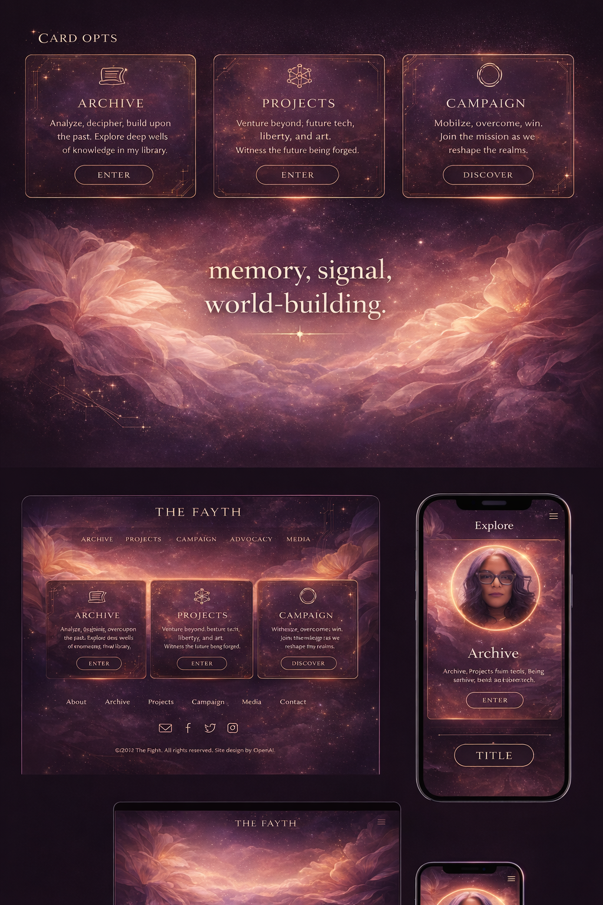
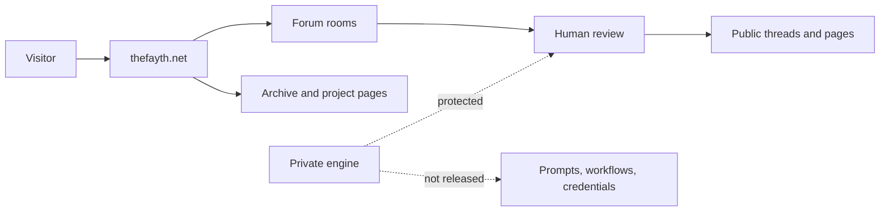

# THEFAYTH

THEFAYTH is a protected public project surface for a memory-centered forum, archive, and project gateway. It presents the public face of Faith's world-building, recall work, multilingual discussion, and AI-assisted forum lanes while keeping the private engine, operational workflows, prompts, credentials, and unpublished materials out of the repository.

This repository is a protected public project surface. It is not the full source code, operational system, private workflow, or data room.

## Why It Matters

THEFAYTH gives memory work a public architecture: rooms, threads, source-backed discussion, project spokes, and a boundary-aware relationship between a public website and protected private systems. It is designed for stories that need context, provenance, language nuance, and human review instead of flattened content feeds.

## Who It Is For

- Readers and collaborators who need a clear public overview of THEFAYTH.
- Visitors coming from FaithCheltenham.com or thefayth.net.
- Supporters who need to understand the public mission without accessing private systems.
- Future contributors who need boundaries before asking for source, strategy, or operational access.

## How It Works

THEFAYTH has a public surface and a private engine.

## Public Materials

This repository includes:

- Project brief, status, roadmap, FAQ, and public-private boundary notes.
- Workflow diagrams for the forum/archive/review model.
- WordPress page and metadata drafts for FaithCheltenham.com.
- Public-safe visual assets selected from the project folder.
- Ownership, trademark, security, and commercial use policies.

## What Remains Private

The source code, WordPress deployment, credentials, prompts, private workflows, customer or family information, unpublished creative work, legal/admin material, medical or benefits records, and operational infrastructure are not included.

<!-- FAITH-AI-SYSTEMS-START -->
## Faith AI Systems Portfolio

I build local-first AI systems that make public websites, GitHub repos, product proof, creative operations, and provenance workflows more credible without exposing private engine work.

### Work With Me

- Public AI systems portfolio: [https://thefayth.github.io/faith-ai-systems-portfolio/](https://thefayth.github.io/faith-ai-systems-portfolio/)
- Work With Faith: [https://thefayth.github.io/faith-ai-systems-portfolio/work-with-faith.html](https://thefayth.github.io/faith-ai-systems-portfolio/work-with-faith.html)
- Quote-first offers: [https://thefayth.github.io/faith-ai-systems-portfolio/offers.html](https://thefayth.github.io/faith-ai-systems-portfolio/offers.html)
- Opportunity router: [https://thefayth.github.io/faith-ai-systems-portfolio/opportunity-router.html](https://thefayth.github.io/faith-ai-systems-portfolio/opportunity-router.html)
- Pilot sprint menu: [https://thefayth.github.io/faith-ai-systems-portfolio/pilot-sprint-menu.html](https://thefayth.github.io/faith-ai-systems-portfolio/pilot-sprint-menu.html)
- Contact: [https://faithcheltenham.com/contact/](https://faithcheltenham.com/contact/)

### Public Proof And Products

- Public proof index: [https://thefayth.github.io/faith-ai-systems-portfolio/public-proof-index.html](https://thefayth.github.io/faith-ai-systems-portfolio/public-proof-index.html)
- Prospect packet: [https://thefayth.github.io/faith-ai-systems-portfolio/prospect-packet.html](https://thefayth.github.io/faith-ai-systems-portfolio/prospect-packet.html)
- TheFAYTH Visual Empire: [https://github.com/thefayth/thefayth-visual-empire](https://github.com/thefayth/thefayth-visual-empire)
- TheFAYTH File Type: [https://github.com/thefayth/thefayth-file-type](https://github.com/thefayth/thefayth-file-type)
- Fantasia: [https://github.com/thefayth/fantas1a](https://github.com/thefayth/fantas1a)

### Licensing, Partners, And Referrals

- Licensing and partnership paths: [https://thefayth.github.io/faith-ai-systems-portfolio/licensing-and-partnership-paths.html](https://thefayth.github.io/faith-ai-systems-portfolio/licensing-and-partnership-paths.html)
- Share/send kit: [https://thefayth.github.io/faith-ai-systems-portfolio/share-send-kit.html](https://thefayth.github.io/faith-ai-systems-portfolio/share-send-kit.html)

Public surfaces show proof, offers, and trust boundaries. Private engines, prompts, credentials, customer data, rollback receipts, signing keys, and protected operational workflows stay private.
<!-- FAITH-AI-SYSTEMS-END -->

## Current Status

Public surface package: ready for review.

Live public site: https://thefayth.net

Faith ecosystem connection: https://faithcheltenham.com

## Visual System

The selected visual language is ethereal, archival, strategic, and human: memory, signal, world-building. It uses existing project visuals instead of generic templates.

## Ownership

All rights reserved. No public license is granted. No redistribution, commercial reuse, training use, or source-code use is permitted without written permission from Faith Cheltenham.

## Learn More

- Public site: https://thefayth.net
- FaithCheltenham.com: https://faithcheltenham.com
- WordPress draft: [wordpress/page.md](wordpress/page.md)
- Project brief: [docs/PROJECT_BRIEF.md](docs/PROJECT_BRIEF.md)
- Boundary notes: [docs/PUBLIC_PRIVATE_BOUNDARY.md](docs/PUBLIC_PRIVATE_BOUNDARY.md)
