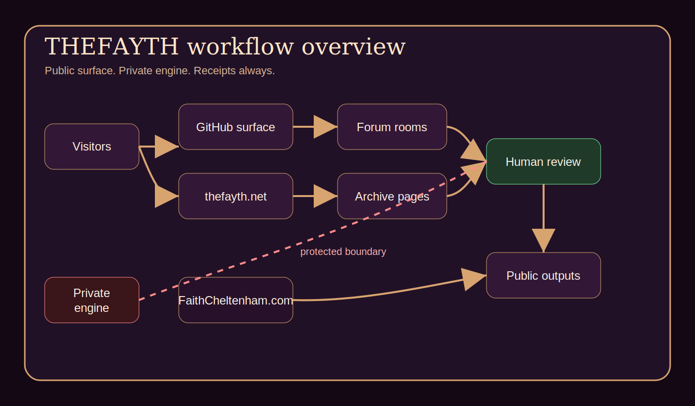
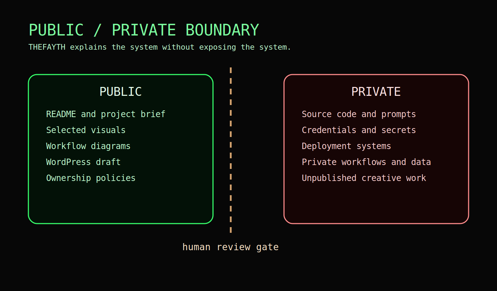

# Workflow Diagrams

This repository includes public-safe workflow diagrams in Mermaid and SVG.

## Overview

Source: `assets/diagrams/workflow-overview.mmd`

## Public / Private Boundary

Source: `assets/diagrams/public-private-boundary.mmd`

## Design Principle

The diagrams show users, inputs, public workflows, review layers, outputs, WordPress/FaithCheltenham connection, GitHub connection, and protected systems without disclosing implementation details.
